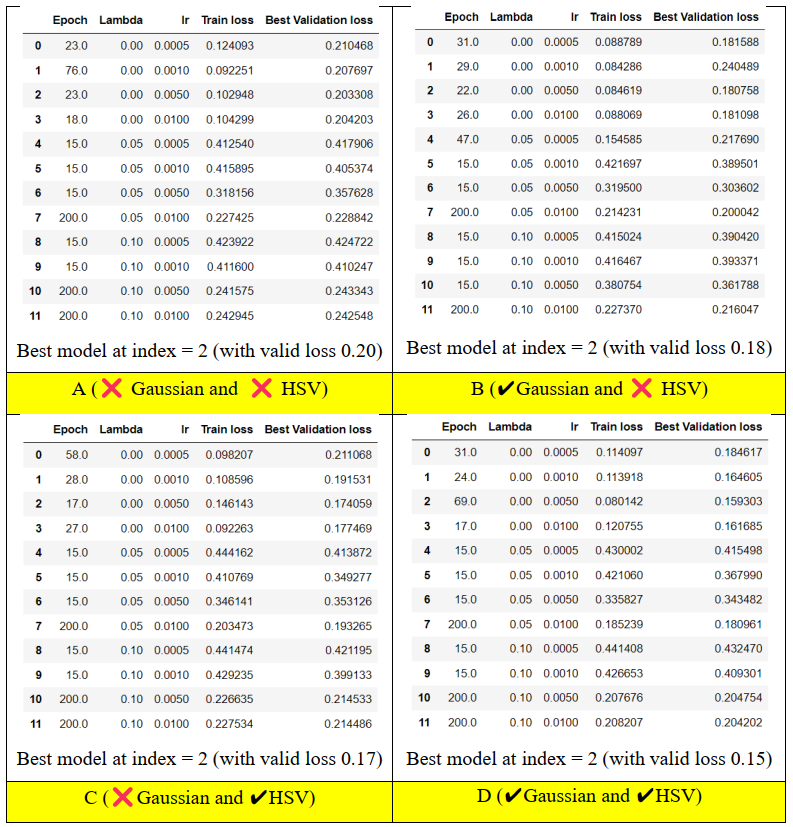
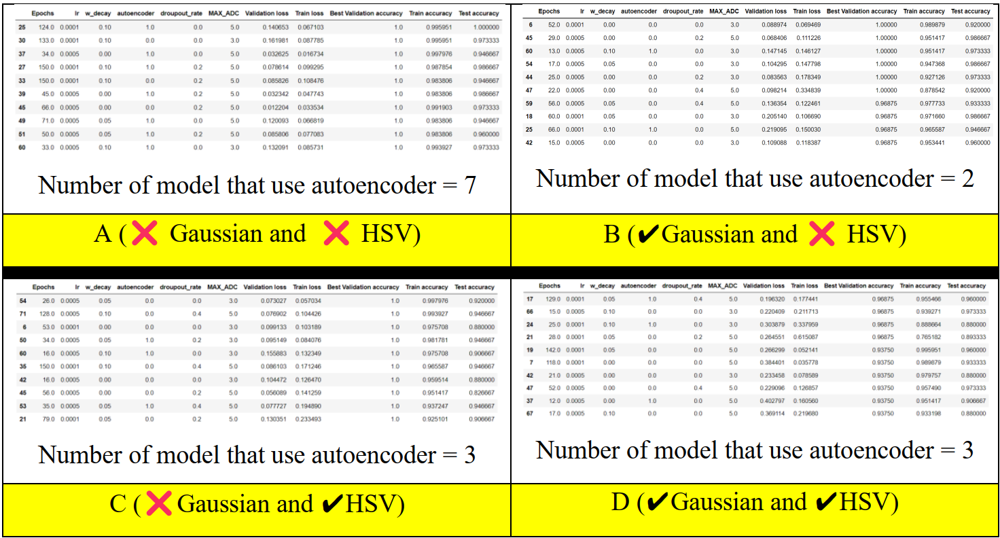

# Day Dusk Night Classification
Author: [Ng Zheng Jue](https://github.com/xinjue37), [Ong Ming Jie](https://github.com/ethanong98), [Ng Rui Qi](https://github.com/Ruiqi2002), [Tan Hong Guan](https://github.com/tanhg1116)

* This is a project developed in undergraduate Year 2 - Semester 2
* This is a Day Dusk Night Classifier implemented using **CNN (Pytorch) with CNN autoencoder for feature extration**. In the mean while, we evaluate the effect of applying Gaussian Low Pass Filter and effect of convert RGB to HSV on the performance of CNN model. 
* The major step of building the CNN Classifier involve:
  * Data Collection - Label each image, remove irrelevant image, and rename each iamge
  * Data Preprocessing - Extract labels from name of images, Resizing all images to 80×80, Color processing: Converting RGB to HSV (Optional), Noise reduction using Gaussian Low Pass Filter (Optional), Splitting the dataset into 70% training and 30% testing, Perform Data augmentation on training dataset, Move the data into DataLoader
  * Build and train CNN autoencoder for Feature extraction
  * Build and train CNN classification model.
  * Evaluate the CNN classification model on the testing dataset
* This repository consists of
  - Database which consists the image of Day, Dusk, Night captured. File naming format: “𝑐𝑙𝑎𝑠𝑠 _𝑖 .jpg”, where 𝑐𝑙𝑎𝑠𝑠 ∈ {𝐷𝑎𝑦,  𝐷𝑢𝑠𝑘,  𝑁𝑖𝑔ℎ𝑡} , 𝑖 ∈ {0,1,2, … }
  - 4 difference jupyter notebook file with difference settings in preprocessing the image

|File|Apply Gaussian Low Pass Filter|Convert RGB to HSV|
|:-:|:-:|:-:|
|1|✖|✖|
|2|✔|✖|
|3|✖|✔|
|4|✔|✔|

## Overall Results 
### Interpretation of Result for CNN Autoencoder
* The loss of the CNN autoencoder is as below:

    

&emsp; As shown, the good model usually does not use weight decay (set lambda =0). And among
them, the best model usually is at index 2 with learning rate = 0.001 (this may vary for different
runs due to the Batch Normalization layer).29
 
&emsp; Besides that, based on the table above, by applying Gaussian low pass filter, the loss between
real image and reconstruction image is smaller (from A->B and C->D). This may be due to
applying Gaussian low pass filter remove some of the noise of the image and smooth out the image
pixel, which help in reconstruction of the image in Convolution Transpose layer.
Furthermore, based on the table above, by convert RGB to HSV, it also helps to increase the
result (from A->C and from B->D). This may be due to HSV is the color model that closer to
human vison perception
* At last, the model with the lowest validation loss will be selected to further classification in the
classification model below

### Interpretation of Result for Classification Model
* The accuracy of the top 10 best classification models based on validation accuracy is as below:

    

&emsp; Based on the result, by convert RGB to HSV, it significantly reduces the accuracy (from
A->C and B->D). This may be due to the difference range of RGB and HSV. For RGB, all channel have range from 0 to 255 while for HSV, H have range from 0 to 150 while S & V have range from 0 to 255.
Since HSV representation resulting a lower range in H, it make the model harder to learn the features of an image. This concept may be explained similarly as using tanh activation function and sigmoid activation function. Generally, tanh activation function is better as it has a higher range.

 
&emsp;Besides that, based on the results, by applying Gaussian low pass filter, it decreases the train
and test accuracy (from A->B) – (the case without converts RGB to HSV), decreases the train and31
validation accuracy (from C->D) but increases the test accuracy (from C->D). In theory, suitable
size of the Gaussian low pass filter with suitable 𝜎2 can remove the noise of the data. Conversely,
if the size is too big or 𝜎2 is too large, it can remove some of the important features in the image.
In our case, the size of the filter or 𝜎2 might be too large, causing it to remove some of the
important features.

## Conclusion 
In short, the model without applied Gaussian filter (B) and without convert RGB to HSV has
the highest accuracy on the train, test, and validation datasets. This shows the amazing power of a
Neural Network in auto-extract feature from the original input data, which is better than human
designed features. We have successfully achieved our aim, which is to produce a model that has a
high accuracy (average 97% accuracy on the dataset) with just about 20,000 weights in the
classification model. However, because the dataset may contain bias, our models are at risk of
overfitting. To solve this problem, one of the best solution increase the size of the quality datasets,
feed them into the model, and train it again
